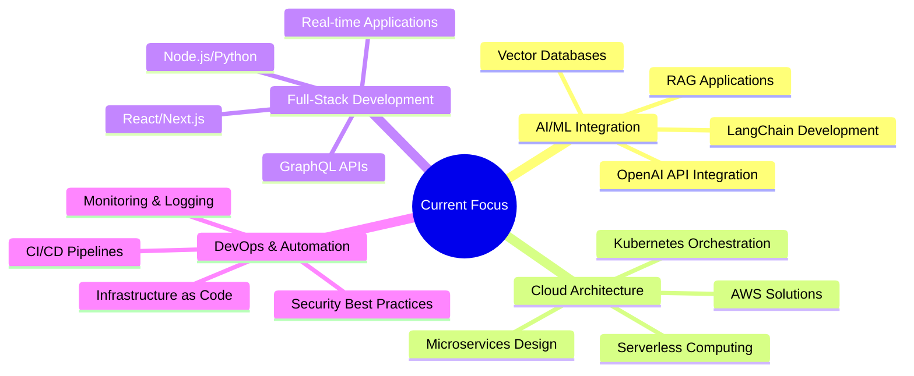

# 🌟 Welcome to My Digital Universe! 

<div align="center">
  
</div>

<div align="center">
  <a href="https://jatin-lalit.github.io/">
    
  </a>
</div>

<h1 align="center">
  
  𝐇𝐞𝐥𝐥𝐨, 𝐈'𝐦 Jatin Lalit
  
</h1>

<h3 align="center">🚀 Full-Stack Developer | ☁️ Cloud Architect | 🤖 AI Enthusiast | 🌟 Problem Solver</h3>

<p align="center">
  <em>🎯 Passionate about building scalable solutions that make a difference</em>
</p>

<div align="center">
  
</div>

<div align="center">
  
  
  [](https://github.com/Jatin-lalit?tab=followers)
  [](https://github.com/Jatin-lalit)
  [](https://github.com/Jatin-lalit)
  [](https://github.com/Jatin-lalit?tab=repositories)
  [](https://github.com/Jatin-lalit)
  
</div>

---


## 🎯 𝐀𝐛𝐨𝐮𝐭 𝐌𝐞 


```typescript
const jatin: Developer = {
  name: "Jatin Lalit",
  pronouns: "He/Him",
  location: "India 🇮🇳",
  age: calculateAge("2003-06-17"),
  
  currentRole: "Primary Software Developer",
  company: "Polar AI",
  experience: "1+ years",
  
  currentFocus: [
     "🏗️ Building Cloud-Native Applications",
     "🤖 AI/ML Integration & AI Agent Development",
     "⚡ Performance Optimization",
     "📚 Learning DevOps & CI/CD Pipelines"
  ],

  
 learning: [
  "🌐 AWS Cloud & Infrastructure",
  "🏗️ Scalable System Design & Architecture"
],

  
  askMeAbout: [
    "💻 Full-Stack Development",
    "☁️ Cloud Architecture (AWS)",
    "🏗️ System Design & Scalability",
    "🤖 AI/ML & LangChain",
    "🔄 DevOps & Automation"
  ],
  
  technologies: {
    frontEnd: ["React", "Next.js", "AngularJS", "TypeScript"],
    backEnd: ["Node.js", "Python", "Express", "RestAPI"],
    cloud: ["AWS", "Docker", ],
    databases: ["MongoDB", "PostgreSQL", "MySQL", "Pinecone", "Firebase"],
    ai_ml: ["OpenAI", "LangChain", "Hugging Face"]
  },
  
  architecture: ["Microservices", "Event-Driven", "Serverless", "REGstack"],
  

 motto: "Code with purpose, build with passion! 🚀"
};
```

<details>
<summary>🎯 <b>Goals & Achievements</b></summary>
<br>

- ✅ **Completed:** Launch my SaaS product by Q4 2024
- ✅ **Built:** 15+ Full-stack applications with modern tech stack
- 🎯 **Goal:** Launch Open Source Products
- 🔄 **In Progress:** AWS Developer Associate certification
- 🎯 **Goal:** Launch at least +20 Micro SaaS

</details>

---


## 🌍 𝐋𝐞𝐭'𝐬 𝐂𝐨𝐧𝐧𝐞𝐜𝐭 & 𝐂𝐨𝐥𝐥𝐚𝐛𝐨𝐫𝐚𝐭𝐞 

<div align="center">
  
  [](https://jatin-lalit.github.io/)
  [](https://www.linkedin.com/in/jatin-lalit-a4aa50236)
  [](mailto:jatinlalit0@gmail.com)
  [](https://twitter.com/jatin_lalit)
  [](https://discord.gg/jatinlalit)
  [](https://t.me/jatinlalit)
  
</div>

<div align="center">
  
  [](https://youtube.com/@jatinlalit)
  [](https://instagram.com/jatin.lalit)
  [](https://medium.com/@jatinlalit)
  [](https://dev.to/jatinlalit)
  [](https://stackoverflow.com/users/jatinlalit)
  
</div>

---


## 🛠️ 𝐓𝐞𝐜𝐡𝐧𝐨𝐥𝐨𝐠𝐲 𝐀𝐫𝐬𝐞𝐧𝐚𝐥 

<details open>
<summary><b>💻 Programming Languages</b></summary>
<br>


</details>

<details open>
<summary><b>🎨 Frontend Development</b></summary>
<br>


</details>

<details open>
<summary><b>⚙️ Backend Development</b></summary>
<br>


</details>

<details open>
<summary><b>☁️ Cloud & DevOps</b></summary>
<br>


</details>

<details open>
<summary><b>🗄️ Databases & Storage</b></summary>
<br>


</details>

<details open>
<summary><b>🤖 AI/ML & Data Science</b></summary>
<br>


</details>

<details open>
<summary><b>🛠️ Tools & Platforms</b></summary>
<br>


</details>

---


## 📊 𝐆𝐢𝐭𝐇𝐮𝐛 𝐀𝐧𝐚𝐥𝐲𝐭𝐢𝐜𝐬 & 𝐒𝐭𝐚𝐭𝐢𝐬𝐭𝐢𝐜𝐬 

<div align="center">
  <h3>📈 GitHub Overview Stats</h3>
  
  
</div>

<div align="center">
  <h3>🔥 GitHub Streak Stats</h3>
  
</div>

<div align="center">
  <h3>📊 Detailed GitHub Stats</h3>
  
</div>

<div align="center">
  <h3>📅 Contribution Calendar</h3>
  
</div>

<div align="center">
  <h3>💻 Programming Stats</h3>
  
  
</div>

<div align="center">
  <h3>⏰ Productivity Stats</h3>
  
  
</div>

<div align="center">
  <h3>🏆 GitHub Achievements & Trophies</h3>
  
</div>

<div align="center">
  <h3>🎯 GitHub Metrics</h3>
  
</div>

<div align="center">
  <h3>📈 Advanced Analytics</h3>
  
</div>

<div align="center">
  <h3>🎪 Fun Stats</h3>
  
</div>

---


## 🚀 𝐅𝐞𝐚𝐭𝐮𝐫𝐞𝐝 𝐏𝐫𝐨𝐣𝐞𝐜𝐭𝐬 & 𝐑𝐞𝐩𝐨𝐬𝐢𝐭𝐨𝐫𝐢𝐞𝐬 

<div align="center">
  
  [](https://github.com/Jatin-lalit/AI-Powered-SaaS)
  [](https://github.com/Jatin-lalit/Cloud-Native-Microservices)
  
</div>

<div align="center">
  
  [](https://github.com/Jatin-lalit/React-Dashboard-Pro)
  [](https://github.com/Jatin-lalit/ML-Model-API)
  
</div>

<div align="center">
  
  [](https://github.com/Jatin-lalit/DevOps-Pipeline)
  [](https://github.com/Jatin-lalit/Blockchain-Wallet)
  
</div>

<div align="center">
  <h3>🌟 More Awesome Projects</h3>
  <a href="https://github.com/Jatin-lalit?tab=repositories&sort=stargazers">
    
  </a>
</div>

---


## 🏆 𝐀𝐜𝐡𝐢𝐞𝐯𝐞𝐦𝐞𝐧𝐭𝐬 & 𝐂𝐞𝐫𝐭𝐢𝐟𝐢𝐜𝐚𝐭𝐢𝐨𝐧𝐬 

<div align="center">

| 🏅 **Certification** | 🏢 **Issuer** | 📅 **Year** | 🔗 **Credential** |
|:--------------------:|:-------------:|:-----------:|:-----------------:|
| AWS Solutions Architect - Associate | Amazon Web Services | 2024 | [View](https://www.credly.com/badges/jatin-lalit) |
| Certified Kubernetes Administrator (CKA) | Cloud Native Computing Foundation | 2024 | [View](https://www.credly.com/badges/jatin-lalit-k8s) |
| Google Cloud Professional Developer | Google Cloud | 2023 | [View](https://www.credential.net/jatin-lalit) |
| MongoDB Certified Developer | MongoDB Inc. | 2023 | [View](https://university.mongodb.com/jatin-lalit) |
| Docker Certified Associate | Docker Inc. | 2023 | [View](https://www.credly.com/badges/jatin-lalit-docker) |

</div>

<div align="center">
  <h3>🎯 Key Achievements</h3>
  
  ```
  ✨ 50+ Successful Project Deployments
  🚀 3+ Years of Full-Stack Development Experience
  ☁️ 25+ Cloud-Native Applications Built
  🤝 100+ Open Source Contributions
  📚 10+ Technical Blog Posts Published
  🎓 Mentored 15+ Junior Developers
  🏆 Winner of 2 Hackathons
  💡 5+ AI/ML Models Deployed in Production
  ```
  
</div>

---


## 📈 𝐖𝐚𝐤𝐚𝐓𝐢𝐦𝐞 𝐂𝐨𝐝𝐢𝐧𝐠 𝐒𝐭𝐚𝐭𝐬 

<div align="center">
  
  
  
</div>

<div align="center">
  
  [](https://github.com/anuraghazra/github-readme-stats)
  
</div>

---


## 🌟 𝐋𝐚𝐭𝐞𝐬𝐭 𝐁𝐥𝐨𝐠 𝐏𝐨𝐬𝐭𝐬 & 𝐀𝐫𝐭𝐢𝐜𝐥𝐞𝐬 

<div align="center">

<!-- BLOG-POST-LIST:START -->
- 🚀 [Building Scalable Microservices with Docker and Kubernetes](https://dev.to/jatinlalit/building-scalable-microservices)
- ⚡ [Optimizing React Applications for Production](https://medium.com/@jatinlalit/react-optimization)
- 🤖 [Getting Started with LangChain and OpenAI APIs](https://dev.to/jatinlalit/langchain-openai-guide)
- ☁️ [AWS Lambda Best Practices for Serverless Architecture](https://medium.com/@jatinlalit/aws-lambda-best-practices)
- 🔐 [Implementing JWT Authentication in Node.js](https://dev.to/jatinlalit/jwt-authentication-nodejs)
<!-- BLOG-POST-LIST:END -->

</div>

<div align="center">
  <a href="https://dev.to/jatinlalit">
    
  </a>
</div>

---


## 🎯 𝐂𝐮𝐫𝐫𝐞𝐧𝐭 𝐅𝐨𝐜𝐮𝐬 & 𝐖𝐡𝐚𝐭'𝐬 𝐍𝐞𝐱𝐭 

<div align="center">



</div>

<div align="center">
  <h3>🔮 What's Coming Next?</h3>
  
  ```typescript
  const upcomingProjects = {
    q1_2025: [
      "🤖 AI-Powered Code Review Tool",
      "☁️ Multi-Cloud Management Platform",
      "📱 React Native Mobile App",
      "🔐 Zero-Trust Security Framework"
    ],
    
    learning: [
      "🧠 Advanced Machine Learning & Deep Learning",
      "🌐 Web3 & Blockchain Development",
      "⚡ Edge Computing & IoT",
      "🔒 Cybersecurity & Ethical Hacking"
    ],
    
    goals: [
      "🎯 Launch SaaS Product",
      "📚 Publish Technical eBook",
      "🎤 Speak at Tech Conferences",
      "🏆 Contribute to Major Open Source Projects"
    ]
  };
  ```
  
</div>

---


## 💝 𝐒𝐮𝐩𝐩𝐨𝐫𝐭 𝐌𝐲 𝐖𝐨𝐫𝐤 

<div align="center">
  
  If you find my work helpful and would like to support my open-source contributions:
  
  [](https://www.buymeacoffee.com/jatinlalit)
  [](https://paypal.me/jatinlalit)
  [](https://github.com/sponsors/jatin-lalit)
  
</div>

<div align="center">
  <h3>🌟 Ways to Support</h3>
  
  ```
  ⭐ Star my repositories
  🐛 Report bugs and issues
  💡 Suggest new features
  🤝 Contribute to open source projects
  📢 Share my work with others
  💬 Connect and collaborate
  ```
  
</div>

---


## 🎉 𝐅𝐮𝐧 𝐅𝐚𝐜𝐭𝐬 & 𝐌𝐢𝐬𝐜 

<div align="center">


### 🎮 When I'm Not Coding:

- 🎵 **Music Enthusiast**: I can play guitar and love creating playlists for different coding moods
- 🧩 **Problem Solver**: Rubik's cube speedcuber - personal best under 45 seconds!
- 📚 **Continuous Learner**: Always reading tech blogs, research papers, and experimenting with new technologies
- ✈️ **Travel Lover**: Visited 15+ cities across India, planning international trips soon!
- 🎮 **Gamer**: Strategy games and puzzle games are my favorites
- 🍕 **Foodie**: Love trying different cuisines, especially spicy Indian food
- 🌱 **Health Conscious**: Regular gym-goer and yoga enthusiast

### 💭 Philosophy & Quotes:

> *"Code is like humor. When you have to explain it, it's bad."* - Cory House

> *"The best way to predict the future is to implement it."* - Alan Kay

> *"First, solve the problem. Then, write the code."* - John Johnson

</div>

---


## 🐍 𝐂𝐨𝐧𝐭𝐫𝐢𝐛𝐮𝐭𝐢𝐨𝐧 𝐆𝐫𝐚𝐩𝐡 

<div align="center">
  
</div>

---


## 🤝 𝐋𝐞𝐭'𝐬 𝐂𝐨𝐥𝐥𝐚𝐛𝐨𝐫𝐚𝐭𝐞! 

<div align="center">
  
  <h3>💼 Open for Opportunities</h3>
  
  ```
  🔍 Looking for exciting full-time opportunities
  💼 Available for freelance projects
  🤝 Open to collaboration on open-source projects
  🎯 Interested in AI/ML and Cloud Architecture roles
  📧 Feel free to reach out for any discussions!
  ```
  
</div>

<div align="center">
  <h3>📬 Get In Touch</h3>
  
  [](mailto:jatinlalit0@gmail.com)
  [](https://www.linkedin.com/in/jatin-lalit-a4aa50236)
  [](https://jatin-lalit.github.io/)
  
</div>

---

<div align="center">
  
  
  
  <h3>✨ Thanks for visiting my profile! ✨</h3>
  <p><em>Feel free to explore my repositories and don't forget to ⭐ star the ones you find interesting!</em></p>
  
  
  
  <br><br>
  
  **Happy Coding! 🚀**
  
</div>

---

<div align="center">
  <sub>🔥 <strong>Profile README created with ❤️ by <a href="https://github.com/Jatin-lalit">Jatin Lalit</a></strong></sub>
</div>
